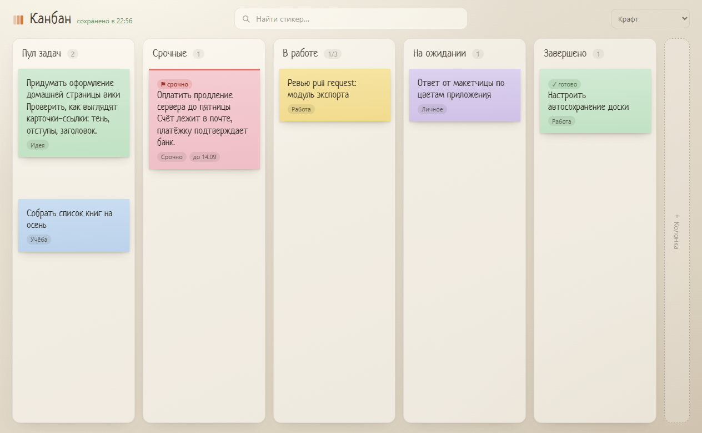
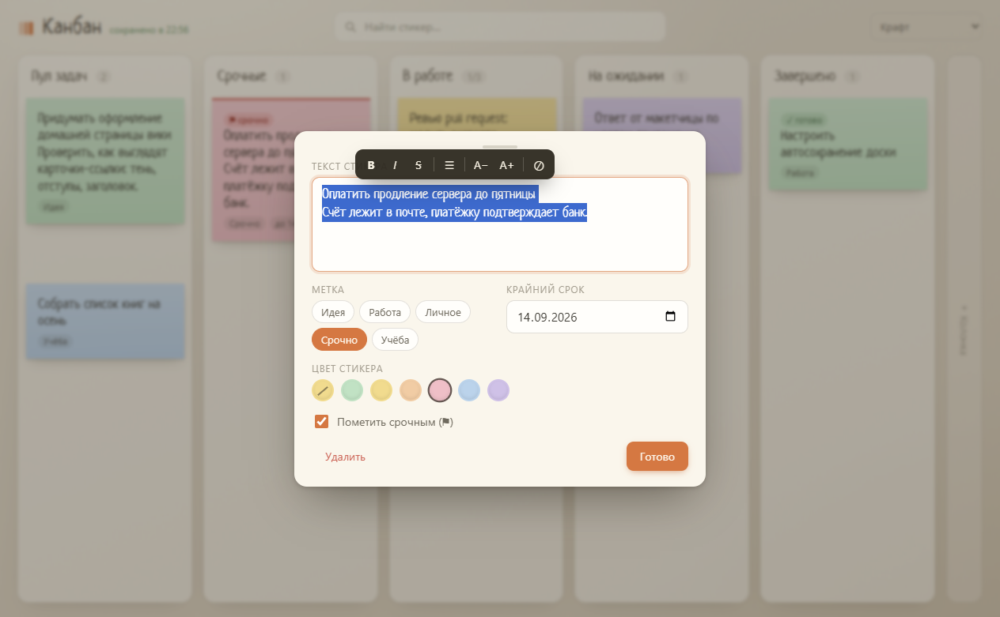

# Канбан — настольная доска со стикерами



Лёгкое настольное приложение для личных задач: рабочий лист, разлинованный на вертикальные поля, а задачи — свободно перемещаемые стикеры. Всё живёт локально на компьютере, никакого облака и регистраций.

## Что это

Метод канбан пришёл с заводов Toyota («канбан» — «видимая карточка»), а в 2010-х Дэвид Андерсон адаптировал его для интеллектуальной работы. Суть метода в том, что поток работы **виден целиком**, а незавершённой работы (work in progress) **ограничено количество**. На практике это доска с колонками-этапами и карточками-стикерами, которые движутся слева направо, пока не доедут до «Завершено».

Это приложение — именно такая доска, только рабочая, без командных надстроек и подписок.

## Возможности

- **Пять колонок по умолчанию** — «Пул задач», «Срочные», «В работе», «На ожидании», «Завершено». Колонки добавляются («＋ Колонка» на доске), переименовываются (клик по заголовку) и удаляются.
- **Свободная доска.** Стикер живёт там, где его бросили, и может стоять на границе колонок. Перетаскивание живое: движется сам стикер, без призрака. Колонка при этом считается по центру стикера.
- **Магнит и расталкивание.** Стикер прилипает к центру дорожки, краям соседей и сетке; наехавший на соседа мягко сдвигает его вниз с живым предпросмотром.
- **Создание в один клик.** Клик по пустому месту — сразу печатаешь (как в OneNote), клик мимо сохраняет. Черновик уже в цвете будущего стикера.
- **Правка на месте.** Клик по стикеру — инлайн-правка текста без модалки; полное окно (метка, цвет, срок) — по карандашу ✎ или Enter. У текста единый блок с рич-форматированием: жирный, курсив, списки, размер шрифта (всплывающий тулбар). Enter — новая строка, сохранение — Ctrl+Enter или клик мимо.
- **Мультивыделение.** Рамка-протяжка, Shift+клик, групповой перенос всей пачки с учётом WIP, удаление пачкой (Delete или кнопка «Удалить») с отменой «Вернуть».
- **Пять тем доски** — «Крафт», «Рисовая бумага», «Пробковая доска» (стикеры на булавках), тёмный «Графит», «Меловая доска». Переключатель в верхней панели, тема хранится вместе с доской.
- **WIP-лимиты.** У колонки можно задать предел числа задач (⚙ в заголовке). Пока лимит выбран, новые стикеры не добавляются и не переносятся — счётчик краснеет и показывает `3/3`. Это и есть pull-система: сначала завершаем, потом берём следующее.
- **Поиск по доске** (Ctrl+F) — фильтрует стикеры на лету, данные не трогает.
- **Автосохранение.** Любое изменение немедленно уезжает в файл в каталоге данных приложения. Подпись в углу показывает время последнего сохранения.
- **Отмена удаления.** Удалённый стикер уходит в мягкий архив, тост предлагает «Вернуть». Архив старше 30 дней вычищается при запуске.
- **Горячие клавиши.** Ctrl+N — новая задача в пуле, Ctrl+F — поиск, Ctrl+Enter — сохранить текст, Esc — закрыть/снять выделение, Delete — удалить выбранные.



## Установка и запуск

### Готовые сборки

Скачай из раздела [Releases](https://github.com/Neuro-Storm/kanban/releases):

- **Linux** — `kanban-1.1.0-x86_64.AppImage`: `chmod +x` и запустить.
- **Windows** — `kanban-setup-1.1.0.exe`: обычный установщик (NSIS).
- **macOS** — собирается из исходников командой `npm run dist:mac` (нужен macOS).

### Из исходников

Нужен Node.js 20+ и npm.

```bash
npm install       # поставит Electron (скачается бинарник)
npm start         # запуск в режиме разработки
```

### Сборка дистрибутива

```bash
npm run dist      # Linux AppImage  → dist/kanban-*.AppImage
npm run dist:win  # Windows-установщик (NSIS), требует wine на Linux-сборщике
npm run dist:mac  # macOS dmg (собирается только на macOS)
```

## Разработка

```bash
npm test          # юнит-тесты ядра доски (node --test), 32 проверки
npm run smoke     # смоук-тест в настоящем Electron (80 проверок: доска, drag, магнит, рамка, темы)
npm run shot      # снять кадры artifacts/preview.png и preview-editor.png
```

### Структура

```
electron/           главный процесс
  main.js           окно, хранилище (атомарная запись JSON), смоук-режим
  preload.js        мост contextBridge — только доска, без файловых API
src/core/store.js   ядро: состояние, правила, порядок, WIP-лимиты, автосохранение
src/ui/             интерфейс: рендер, перетаскивание, редактор, тосты
tests/unit.test.cjs юнит-тесты ядра
scripts/            smoke.sh, shot.sh, make-icon.sh
assets/fonts/       Neucha и Caveat (SIL OFL)
build/              иконка приложения
```

### Как устроено (коротко)

- **Ядро отделено от UI.** `store.js` не знает ни о DOM, ни об Electron: его гоняют юнит-тесты в чистом Node. Это позволяет проверять правила (лимиты, порядок, санитизацию) без запуска графики.
- **Порядок задаётся дробными числами.** Вставка между соседями берёт середину между их `order`; если соседи стали слишком близки, доска нормализуется шагами по 1000. Гонка сходимости проверена тестом на 40 вставок в одну щель.
- **Атомарная запись.** Файл доски пишется через временный файл и переименование — обрыв не оставит половинчатый JSON. При загрузке данные санитизируются: битые задачи отбрасываются, чужие колонки чинятся, старые удалённые вычищаются. Всё, что не удалось прочитать, не роняет приложение — поднимается стартовая доска.
- **Перетаскивание своё.** Никаких drag-n-drop библиотек: pointer-события, движется сам стикер (без призрака), подсветка дорожки, магнит к центру/краям/сетке, живое расталкивание соседей. Без зависимостей — значит, без сюрпризов в поведении.
- **Темы — токены.** Оформление задаётся CSS-переменными под `html[data-theme]`; выбор хранится в файле доски (`board.theme`), старые файлы молча получают «Крафт».

### Палитра и оформление

Фон — тёплый «письменный стол» с бумажной фактурой, дорожки — полупрозрачные листы, стикеры — шесть пастельных цветов без наклонов (наклоны мылили текст). Шрифты: Neucha (заголовки и текст на стикерах) и Caveat (акценты) — оба под лицензией SIL OFL 1.1, лежат в `assets/fonts/`. Тёмные темы («Графит», «Меловая доска», «Пробка») перекрашивают и стикеры, редактор при этом остаётся светлым листом.

Приложение уважает системную настройку `prefers-reduced-motion` — анимации отключаются.

## Где лежат данные

`kanban-board.json` в каталоге данных приложения:

- **Windows**: `%APPDATA%/Канбан/kanban-board.json`
- **macOS**: `~/Library/Application Support/Канбан/kanban-board.json`
- **Linux**: `~/.config/Канбан/kanban-board.json`

Файл — обычный JSON, его можно скопировать или отредактировать при выключенном приложении.

## Лицензия

MIT. Шрифты — SIL OFL 1.1 (см. `assets/fonts/OFL.txt`).
